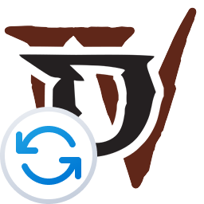

# D4Launcher
[![Badge_Download]][Download_GitHub]

<b>D4Launcher</b> это программа для владельцев Diablo IV из России и Беларуси, что каким-либо образом получили игру на свой аккаунт. 
Позволяет устанавливать, обновлять и чинить (проверкой файлов) и запускать игру с комфортом. 
Программа является форком [Battle.Net Installer](https://github.com/barncastle/Battle.Net-Installer) с реализацией простого доступа к функционалу путем графического интерфейса.

#### Требования
- Минимум Windows 10 1909, или новее.
- [.NET 6.0](https://dotnet.microsoft.com/download/dotnet)
- [Battle.net](https://www.blizzard.com/en-us/apps/battle.net/desktop) должен быть установлен, обновлен, и вы должны быть авторизованны.

### Инструкция
- Скачиваем программу, ложим её в папку, где будет (или лежит) ваша Diablo IV.
- Запускаем программу и, выбрав язык, жмем <b>Установить</b> (или <b>Обновить</b>). Если игра не установлена или требует обновления. Не забываем сначала включить Battle.Net.
- Первый запуск игры просто жмем <b>Играть</b>, при её нажатии запускается `Diablo IV.exe` с параметром `-launch`.
- После первой авторизации в игре тыкаем <b>Запомнить пароль</b> и жмем <b>Играть</b>, в таком случае запускается `Diablo IV.exe` с параметром `-launch -sso`.
- Если у программы D4Launcher вышло обновление, в статусной строке внизу будет написано об этом, советуется всегда обновлять программу дабы иметь лучший опыт в её использовании.

### Важная инфа
Прошу учесть вас, что я не программист ни разу, просто "тут и сям" самоучка. 
В адаптации кода оригинальной программы для использования с гарфическим интерфейсом мне помогал мой друг [Bachar](https://github.com/Bachar-official).
Разобраться с тем как что делать вообще мне немного помогал мне ChatGPT (через страдания). 
Если вы встретили проблемы при работе с программой - создайте [Issue](https://github.com/EvilToasterDBU/D4-Launcher/issues/new/choose) и расскажите там подробнее о проблеме. 
Если вы хотите поблагодарить меня за программу вы можете сделать это по ссылакам через [Qiwi](https://donate.qiwi.com/payin/EvilToasterDBU) и [Boosty](https://boosty.to/eviltoaster/donate).

### Известные проблемы
- Выбор языка сейчас в бета режиме, т.к. я не до конца прощупал как оно работает. Возможно в будущем уберу его или наоборот доработаю функцию.
<!----------------------------------------------------------------------------->

[Download_GitHub]: https://github.com/EvilToasterDBU/D4Launcher/releases/latest/download/D4Launcher.zip

<!---------------------------------{ Badges }---------------------------------->

[Badge_Download]: https://img.shields.io/github/downloads/EvilToasterDBU/D4Launcher/total?color=green&label=Скачать&logo=windows&style=for-the-badge